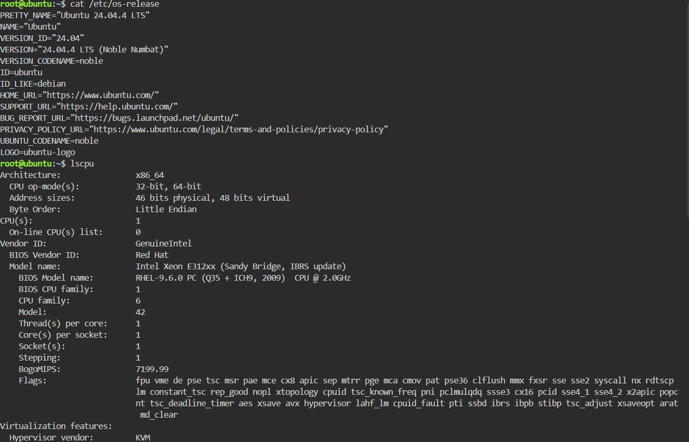

# Laboratory 03: Multi-Cloud Explorer

**Student Name:** RENZ LOUIE M. SAMILIN  
**Course & Block:** BSIT 4 F  
**Subject:** Cloud Computing (CCM101)  

---

## Mission Overview
As a member of the Cloud Evaluation Team at CloudNova Technologies, this laboratory explores the world's leading public cloud platforms: Amazon Web Services (AWS), Microsoft Azure, and Google Cloud Platform (GCP). The goal is to compare core cloud capabilities, map service equivalents, evaluate business scenarios, and document findings using Markdown.

---

## Checkpoint 7: Linux Investigation (KillerCoda)

### System Commands Executed
- **Operating System:** `cat /etc/os-release` or `lsb_release -a`
- **CPU Information:** `lscpu` or `cat /proc/cpuinfo`
- **Memory (RAM):** `free -h`
- **Disk Space:** `df -h`

### Terminal Output Screenshot

### Cloud Migration Analysis
If this Linux server were migrated to the cloud, it could be hosted on the following Virtual Machine infrastructure-as-a-service (IaaS) offerings:
- **AWS:** Amazon EC2 (Elastic Compute Cloud)
- **Azure:** Azure Virtual Machines
- **GCP:** Google Compute Engine

---

## Repository File Structure
