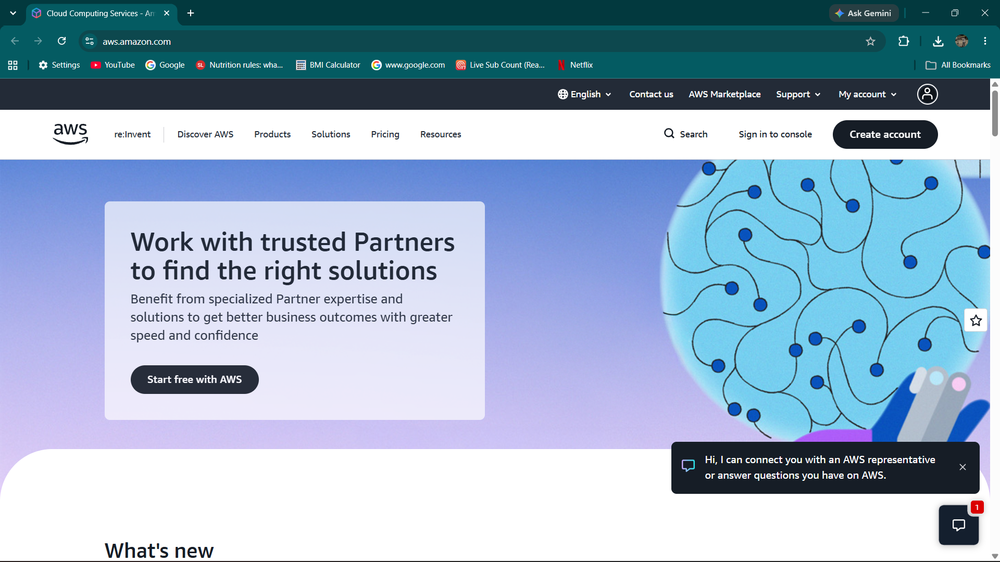

# Amazon Web Services (AWS) Research

## Brief Overview
Launched in 2006 by Amazon, AWS is the pioneer and market leader in cloud computing. It offers an extensive, feature-rich suite of cloud infrastructure and platform services.

## Global Infrastructure
AWS operates in over 30 geographic Regions worldwide, with each Region comprising multiple isolated, physically separate Availability Zones (AZs) connected through low-latency networking.

## Cloud Management Console
The AWS Management Console provides a web-based, user-friendly graphical interface alongside command-line options (AWS CLI) and SDKs to manage AWS resources securely.

## Core Services
1. **Amazon EC2 (Elastic Compute Cloud):** Provides scalable, resizable virtual servers in the cloud.
2. **Amazon S3 (Simple Storage Service):** Offers scalable object storage for data backup, archiving, and analytics.
3. **Amazon RDS (Relational Database Service):** Managed relational database engine supporting MySQL, PostgreSQL, and Aurora.
4. **AWS IAM (Identity and Access Management):** Securely controls access to AWS resources and services.

## Advantages
- Unmatched breadth and depth of cloud services.
- Highly mature ecosystem with extensive community support.
- Flexible pricing with flexible pay-as-you-go models.

## Enterprise Use Cases
- Web and mobile application hosting.
- Enterprise data warehousing and big data analytics.
- Disaster recovery and scalable backup storage.
