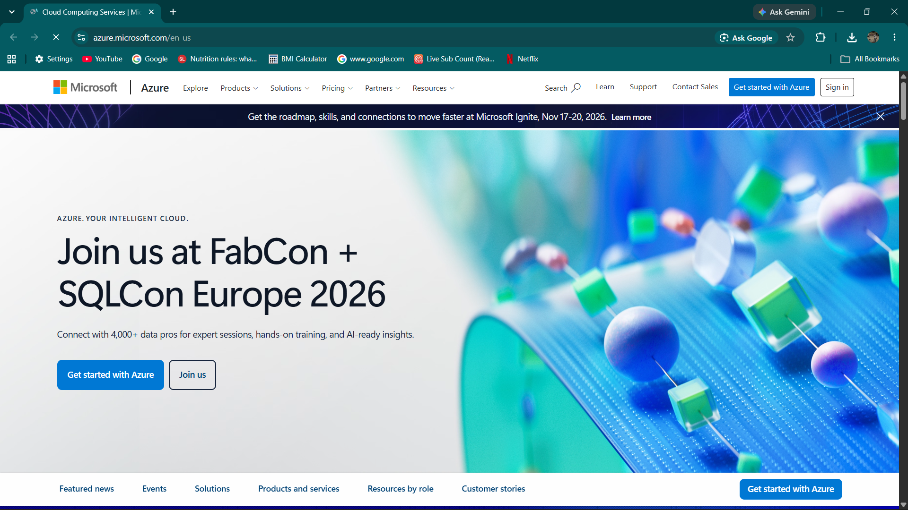

# Microsoft Azure Research

## Brief Overview
Launched in 2010 by Microsoft, Azure is a leading cloud platform known for its seamless integration with enterprise Microsoft software and robust hybrid cloud solutions.

## Global Infrastructure
Azure boasts one of the largest global footprints in the cloud industry, spanning over 60 regions worldwide with dedicated availability zones and an extensive global network fiber.

## Cloud Management Console
The Azure Portal offers a customizable, browser-based management console that allows users to build, manage, and monitor everything from simple web apps to complex cloud applications.

## Core Services
1. **Azure Virtual Machines:** On-demand Linux and Windows virtual machines.
2. **Azure Blob Storage:** Massively scalable object storage for unstructured data.
3. **Azure SQL Database:** Fully managed relational database based on Microsoft SQL Server.
4. **Microsoft Entra ID (formerly Azure Active Directory):** Cloud-based identity and access management service.

## Advantages
- Native integration with Microsoft products (Windows Server, Active Directory, Office 365).
- Superior hybrid cloud capabilities via Azure Arc.
- Strong enterprise licensing agreements and cost benefits (Azure Hybrid Benefit).

## Enterprise Use Cases
- Hybrid cloud deployments for enterprise environments.
- Migration of legacy Windows Server and SQL Server workloads.
- Enterprise identity and access management solutions.
