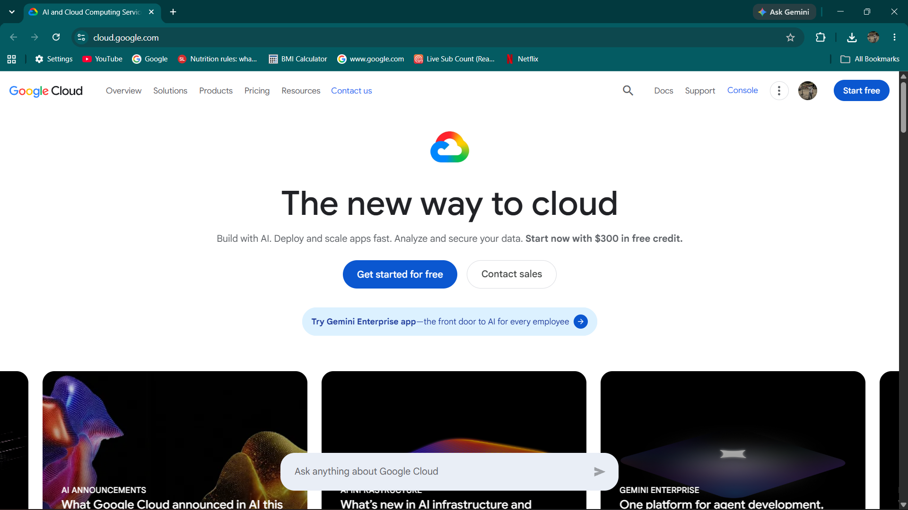

# Google Cloud Platform (GCP) Research

## Brief Overview
Launched in 2008, Google Cloud Platform (GCP) is Google's suite of cloud computing services built on the same high-performance global infrastructure that Google uses for products like Google Search and YouTube.

## Global Infrastructure
GCP runs on Google's private, high-speed global network connecting global regions, zones, and edge points of presence across the world.

## Cloud Management Console
The Google Cloud Console provides a clean, intuitive web UI accompanied by Cloud Shell, a built-in command-line environment available directly in the browser.

## Core Services
1. **Google Compute Engine (GCE):** High-performance virtual machines running in Google's data centers.
2. **Google Cloud Storage (GCS):** Unified, durable object storage for data of any size.
3. **Google Kubernetes Engine (GKE):** Managed environment for deploying, managing, and scaling containerized applications.
4. **Google Cloud IAM:** Fine-grained authorization and access control for GCP resources.

## Advantages
- Industry-leading capabilities in Artificial Intelligence, Machine Learning, and Big Data.
- Advanced container management (originator of Kubernetes).
- Extremely fast and efficient private global network infrastructure.

## Enterprise Use Cases
- Advanced machine learning and AI model training.
- Real-time big data processing and analytics using BigQuery.
- Containerized application delivery using Kubernetes.
