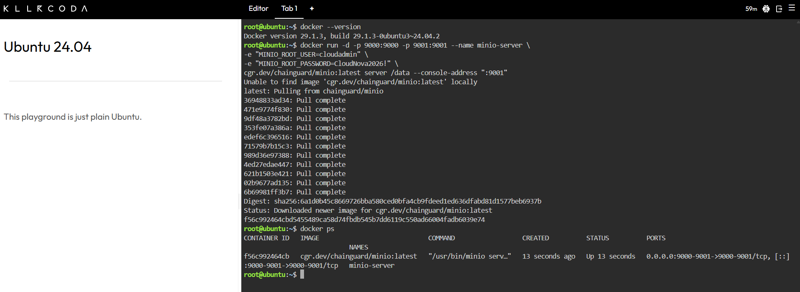
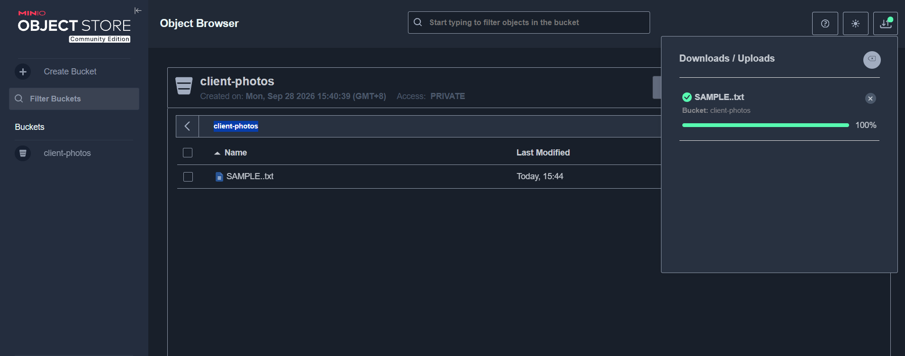

# MinIO Deployment Documentation

## Docker Command Used

```bash
docker run -d -p 9000:9000 -p 9001:9001 --name minio-server \
-e "MINIO_ROOT_USER=cloudadmin" \
-e "MINIO_ROOT_PASSWORD=CloudNova2026!" \
cgr.dev/chainguard/minio:latest server /data --console-address ":9001"
```

## Deployment Details

| Item | Value |
|------|-------|
| Container name | `minio-server` |
| Image | `cgr.dev/chainguard/minio:latest` |
| API port | 9000 |
| Web console port | **9001** |
| Login user | `cloudadmin` |
| Bucket created | **client-photos** |
| File uploaded | *(write the filename you uploaded)* |

## Image Used

I used the Chainguard MinIO image (`cgr.dev/chainguard/minio:latest`) instead of `minio/minio`. It is still MinIO, but built as a minimal, security-hardened image with fewer unnecessary packages.

## What the `-e` Flags Did

The `-e` flag sets **environment variables** inside the container when it starts.

- `MINIO_ROOT_USER=cloudadmin` sets the administrator username for MinIO.
- `MINIO_ROOT_PASSWORD=CloudNova2026!` sets the administrator password.

This allowed me to define the login credentials at launch without modifying the image.

## Other Parts of the Command

- `-d` runs the container in the background (detached mode).
- `-p 9000:9000` maps the MinIO API port to the host.
- `-p 9001:9001` maps the web console port to the host.
- `--name minio-server` gives the container a readable name.
- `cgr.dev/chainguard/minio:latest` is the image Docker pulled to create the container.
- `server /data` tells MinIO to store its objects in the `/data` directory.
- `--console-address ":9001"` sets the port used by the web console.

## Steps Performed

1. Launched a KillerCoda Ubuntu Playground.
2. Ran the `docker run` command above to start MinIO.
3. Verified the container was running with `docker ps`.
4. Opened port **9001** through the Traffic / Ports menu to access the MinIO Console.
5. Logged in with the credentials set in the environment variables.
6. Created a bucket named **client-photos**.
7. Uploaded a sample file into the bucket.

## Evidence

### Container deployed


### Bucket created and file uploaded

